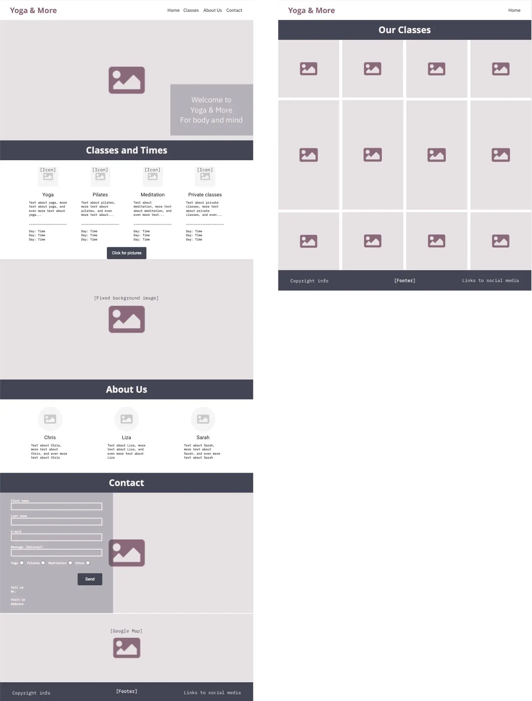
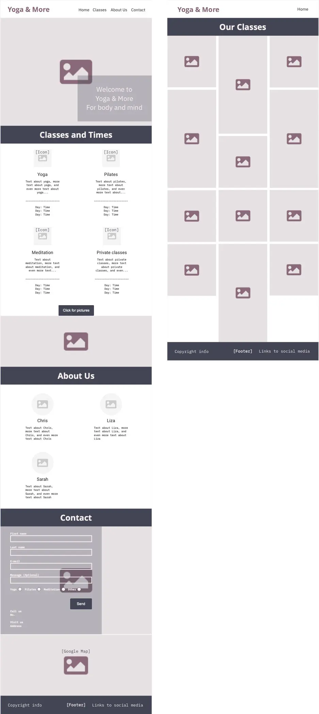
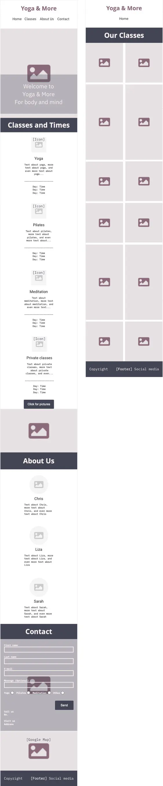

# Yoga & More

Yoga & More is a website that aims to inspire people to come and enjoy yoga, pilates and meditation in Helsingborg, Sweden. The site is targeted towards people who want a small studio with a pleasant, calm and relaxing setting for their classes. Yoga & More will be useful for people to be able to find out what times different classes are, who leads the class, how to get in touch, and where the studio is located.

A link to the live website can be found [here](https://mariechessler.github.io/yoga-and-more/index.html), and a link to the repository [here](https://github.com/MarieCHessler/yoga-and-more).

 

## Design

*** 

 

### Color Palette

* The site's primary colors are (from left to right) Dark Jungle Green, Independence, Taupe Grey, Old Lavender and Isabelline, as seen in the picture above. They were derived using the online tool [Coolors](https://coolors.co), to complement each other in a good way, and still making contrasts possible.
    * Dark Jungle Green is used for text and menu, for best contrast on white
    * Independence is used for dark backgrounds
    * Taupe Grey is used as hover color and for Classes icons
    * Old Lavender is used for the logo
    * Isabelline is used instead of white for text and headings on dark background   
* The colors are all soft, to mirror the feeling in the studio and the colors in the hero image

 

### Typography

* Raleway is used for text and menu, since it it easy to read. Fallback font is sans-serif
* Montez is used for logo and headings, since it fits well with the soft feeling of yoga, pilates and meditation. Fallback font is sans-serif
* Both fonts are from Google Fonts, where they are considered to be a popular pairing

 

### Layout

* The majority of the content is placed in sections on the main page, rather than on separate pages. The reason is that not all content would fill a whole page, and thus result in a lot of white space or a footer too high up on the page
* The image gallery has been placed on a separate page, called Our Classes, since it takes up a lot of space
* For desktop layout the content has been divided into up to four columns, for tablet at least one column less, and for mobile at least two columns less, depending on content and page.

 

### Wireframes

* The wireframes were used to structure the page content for desktop, tablet and mobile screens. The structure differs between screen sizes, for the user to be able to see and access the content properly.

 

 

## Features

***

Describe each of the different parts of the project in a sentence. Value for the user, based on who the site is for, what they want to achieve and how this will helt them achieve it

<h3>Existing features</h3>
    <ul>
        <li>Navigation bar</li>
            <ul>
                <li>Description</li>
                <li>What it will help the user do</li>
            </ul>
        <li>Landing page image</li>
            <ul>
                <li>Description</li>
                <li>What it will help the user do</li>
            </ul>
        <li>Main section</li>
            <ul>
                <li>Description</li>
                <li>What it will help the user do</li>
            </ul>
        <li>Times section</li>
            <ul>
                <li>Description</li>
                <li>What it will help the user do</li>
            </ul>
        <li>Footer</li>
            <ul>
                <li>Description</li>
                <li>What it will help the user do</li>
            </ul>
        <li>Name of second page</li>
            <ul>
                <li>Description</li>
                <li>What it will help the user do</li>
            </ul>
        <li>Name of third page</li>
            <ul>
                <li>Description</li>
                <li>What it will help the user do</li>
            </ul>
    </ul>

<h3>Features left to implement</h3>
    <ul>
        <li>Another feature idea</li>
    </ul>

<h2>Testing</h2>
    
Show and document that all features work as intended, that the user can achieve their goals and how the project looks and works on different browsers and screen sizes

<h3>Validator testing</h3>
    <ul>
        <li>HTML</li>
            <ul>
                <li>Errors/no errors were returned when passing through the official W3C validator</li>
            </ul>
        <li>CSS</li>
            <ul>
                <li>Errors/no errors were returned when passing through the official (Jigsaw) validator</li>
            </ul>
    </ul>

<h3>Unfixed bugs</h3>
    
Mention unfixed bugs and why they are not fixed, shortcomings etc

<h2>Deployment</h2>
    
The site was deployed to GitHub pages by following these steps:

    <ul>
        <li>Step 1</li>
        <li>Step 2</li>
        <li>Step 3</li>
        <li>Step 4</li>
    </ul>
    
The live link can be found here: "#"

<h2>Credits</h2>
    
The references mentioned in this section have been used when it comes to content and media

<h3>Content</h3>
    <ul>
        <li>Reference 1</li>
    </ul>

<h3>Media</h3>
    <ul>
        <li>Reference 1</li>
    </ul>