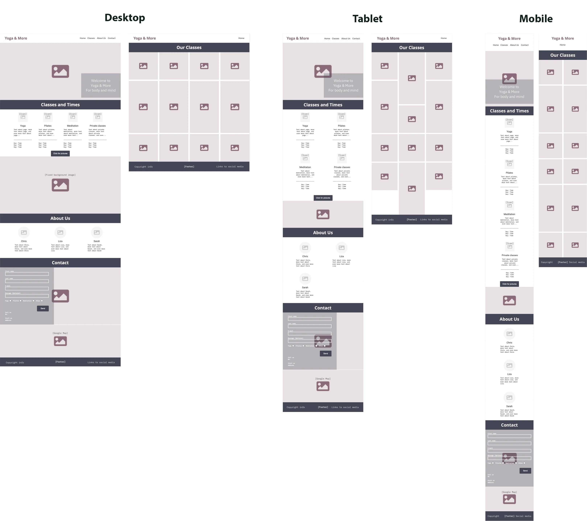
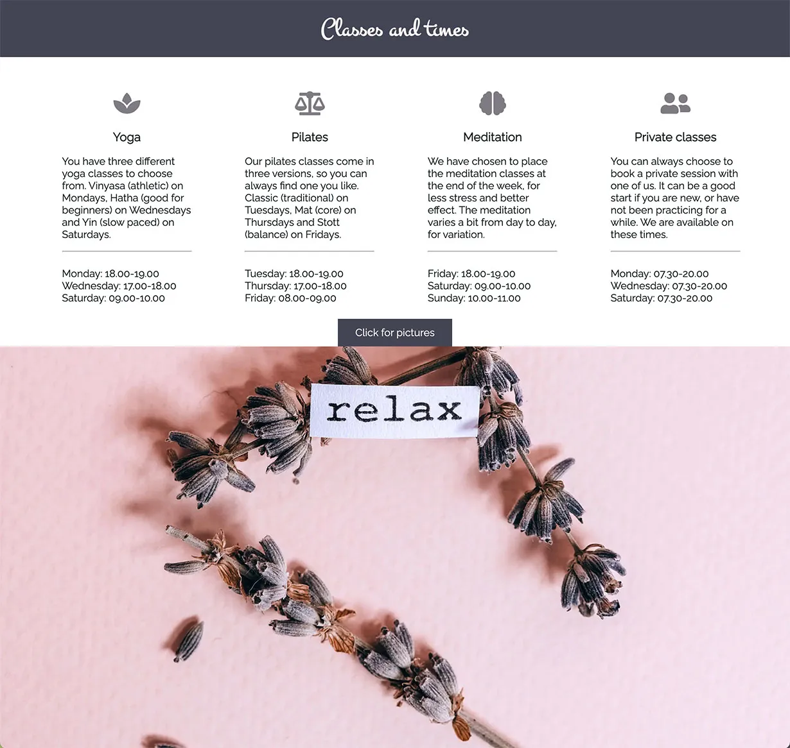

# Yoga & More

Yoga & More is a website that aims to inspire people to come and enjoy yoga, pilates and meditation in Helsingborg, Sweden. The site is targeted towards people who want a small studio with a pleasant, calm and relaxing setting for their classes. Yoga & More will be useful for people to be able to find out what times different classes are, who leads the class, how to get in touch, and where the studio is located.

A link to the live website can be found [here](https://mariechessler.github.io/yoga-and-more/index.html), and a link to the repository [here](https://github.com/MarieCHessler/yoga-and-more).

 

## Design

*** 

 

### Color Palette

* The site's primary colors are (from left to right) Dark Jungle Green, Independence, Taupe Grey, Old Lavender and Isabelline, as seen in the picture above. They were derived using the online tool [Coolors](https://coolors.co), to complement each other in a good way, and still making contrasts possible.
    * Dark Jungle Green is used for text and menu, for best contrast on white.
    * Independence is used for dark backgrounds.
    * Taupe Grey is used as hover color and for Classes icons.
    * Old Lavender is used for the logo.
    * Isabelline is used instead of white for text and headings on dark background   
* The colors are all soft, to mirror the feeling in the studio and the colors in the hero image.

 

### Typography

* Raleway is used for text and menu, since it it easy to read. Fallback font is sans-serif.
* Montez is used for logo and headings, since it fits well with the soft feeling of yoga, pilates and meditation. Fallback font is sans-serif.
* Both fonts are from Google Fonts, where they are considered to be a popular pairing.

 

### Layout

* The majority of the content is placed in sections on the landing page, rather than on separate pages. The reason is that not all content would fill a whole page, and thus result in a lot of white space, or a footer placed too high on the page.
* The image gallery has been placed on a separate page, called Our Classes, since it takes up a lot of space.
* For desktop layout the content has been divided into up to four columns, for tablet at least one column less, and for mobile at least two columns less, depending on content and page.

 

### Wireframes

* Wireframes were used to structure the page content for desktop, tablet and mobile screens. The structure differs between screen sizes, for the user to be able to see and access the content properly.

 

 

## Features

***

The features described below have been implemented to give the user a pleasant experience, with a site that contains useful information and imagery, and is easy to navigate.

 

### Existing features

* **Navigation bar**
    * The fully responsive navigation bar holds the logo and the menu.
    * The logo links back to the landing page, which is considered best practice. In this case it helps the user get back from the Our Classes page.
    * The full menu is featured on the landing page, where it links to the different sections in the page - Home, Classes, About Us and Contact. Since internal links cannot be used between pages only Home is featured on the Our Classes page, providing the user with a link back to the landing page.

 

* **Landing page (hero) image**
    * The top of the landing page includes a hero image, with an animation to catch the users attention.
    * The image also has text overlay that welcomes the user to the page, and indicates that the studio is taking care of both body and mind.

 

* **Classes and Times section**
    * The Classes and Times section includes the classes and times for yoga, pilates, meditation and private classes, which makes it easy for the user to see what classes are the most suitable.
    * The short description of the different classes are helpful for the user to find out what there is to choose from and what level of experience is needed.
    * The fixed background image enhances feeling of the studio, thanks to the harmonious colors and content.
    * The button shaped link below the text invites the user to take a look at some pictures from the studio and get inspired.

 

* **About Us section**
    * The About Us section allows the user to see who is teaching the different classes, and get a bit of background information about the different teachers. 
    * Photos of the teachers help the user become familiar with their faces, and makes it easier to identify them when arriving at the studio. The photos also build trust, since the teachers look nice and kind.

 

* **Contact section**
    * The Contact section gives the user excellent opportunities to get in touch with Yoga & More, as it includes a contact form, a phone number and an address to the studio.
    * In the form it is mandatory for the user to provide first and last name, e-mail address and what he or she is contacting the studio about, so the staff knows who has contacted them and can choose who is best suited to answer the question. The message field can be used, but is optional.
    * The background image has a calming effect, due to the balancing stones and the water.
    * At the end of the section the user finds a Google Map, where the studio's location is marked, which makes it easier to find the place and plan the visit.

* **Footer section**
    * In the footer the user finds copyright information and links to Yoga & More's social media channels on Instagram, Facebook, Twitter and YouTube. The links open in new tabs to make it easy for the user to navigate without using the back button.
    * The footer incourages the user to connect with Yoga & More on social media, which helps the him or her stay updated and feel included.
    * The section is included in all pages

 

* **Our Classes page**
    * The Our Classes page shows pictures of teachers and classes in the studio, to give the user a feeling for the place.
    * This page is a great way for the user to get a feel for the place and a good view of what the different classes look like.
    * The logo and the Home menu item at the top provide the user with two easy ways to get back to the landing page.

 

### Features for the future
* Back to top link, or hamburger menu, beside section headlines. Needed if content grows.
* Send functionality for the contact form. As of now GET is used instead of POST, since there is nowhere to post the info to. Validation is needed, and I have not learned that yet, so I have used GET together with an action that takes the user to a Thank you page that opens in a new window.
* A video where the teachers introduce the studio and themselves.

 

## Testing

***

The site has been tested through both validator testing and manual testing. Details are provided in the sections below.

 

### Validator testing
* HTML
    * No errors or warnings were found on index.html, our-classes.html or thank-you.html, when passing through the official [W3C validator](https://validator.w3.org/#validate_by_input).

 

* CSS
    * No errors were found on style.css, when passing through the official [W3C (Jigsaw) validator](https://jigsaw.w3.org/css-validator/#validate_by_input).
    * One warning was returned, saying "Imported style sheets are not checked in direct input and file upload modes".

 

### Manual testing
* The following has been checked manually, on different devices (see below):
    * Links, menu items and buttons working properly.
    * External links and Thank you page opening in new tabs.
    * Form working properly, asking user to fill out mandatory fields.
    * Images showing in right proportions and places.
    * Fixed image staying in the background on scroll.
    * Map showing the right adress, and opening in new tab when Show larger map is clicked.
    * Responsiveness working properly, and no content moving in unexpected ways when screen size changes.

 

* Checks have been made on these devices and in these browsers:
    * iMac 27"
    * MacBook Pro 13"
    * iPad generation 6
    * iPhone XR and 11
    * HP EliteBook
    * HP ProBook
    * Safari - Version 15.0 (16612.1.29.41.4, 16612)
    * Chrome - Version 95.0.4638.54 (Official version) (x86_64)
    * Edge - Version 95.0.1020.30 (Official version) (64 bit)

 

* The site's responsiveness has been checked in Google DevTools throughout the project.

 

* The site has been run in Lighthouse, with the following results for the landing page, Our Classes and Thank you on desktop.

 

* The site has been run in Lighthouse with the following results for the landing page, Our Classes and Thank you on mobile.

 

* The reasons the score is less than 100% on Performance are the following:
    * For the landing page on desktop, scoring 99%, I did not manage to solve how to use passive listeners, or serve static assets (images) with an efficient cache policy.
    * For the landing page on mobile, scoring 93%, Largest Contentful Paint has been improved, but needs more improvement for excellent score. Also, I did not manage to solve how to use passive listeners, or serve static assets (images) with an efficient cache policy.
    * For the Our Classes page on mobile, scoring 98%, I did not manage to solve how to serve static assets (images) with an efficient cache policy.
    * For the Thank you page on mobile, scoring 97%, the Cumulative Layout Shift was 0.11, which means it needs a minor improvement for excellent score. 

 

## Bugs
The bugs reported in the following section are a selection of the most prominent ones, that needed extra consideration and work.

 

### Fixed bugs
* **Bug:** White line around the whole page.
    * **Fix:** Add width:100% and margin:0px to body.

 

* **Bug:** H2 heading background colors gathering at the top of the Classes & Times section.
    * **Fix:** Remove float:left.

 

* **Bug:** White line under the pictures in the Our Classes page.
    * **Fix:** Use display:block for id our-classes-pictures img.

 

* **Bug:** Menu items shows in the wrong order.
    * **Fix:** Set id menu to float:right and id menu li to float:left.

 

* **Bug:** Menu for screen sizes 770px and down will not be centered.
    * **Fix:** Add display:flex, justify-content:center, margin-top:0px and margin-bottom: 0px to the float:right and width:100% for id menu, and add padding:0.5em for id menu li.

 

* **Bug:** Too long loading time.
    * **Fix:** Change images from jpg to webp. Webp was chosen over AVIF, since AVIF is not supported by Apple devices yet.

 

* **Bug:** Fixed background image does not work on Apple devices running on iOS, only on those running on macOS.
    * **Fix:** Since background-attachment:fixed is not supported for Apple devices running on iOS, all screens from 1120px (iPad Pro) and down get a smaller image instead, and background-attachment is changed to unset to make the image follow the scroll.

 

* **Bug:** Cumulative Layout Shift is too high when running Our Classes in Lighthouse.
    * **Fix:** Set width and height on images in our-classes.html, and height:auto for our-classes-pictures img in styles.css.

 

### Unfixed bugs
* Bugfix for centered menu in screen sizes 770px and down does not work for 340px and down. Several of the settings from that bugfix have therefore been unset for screens 340px and down, to avoid bad user experience. Original settings work better for the smallest screens at this point.

* No other known bugs

 

## Deployment

***

### GitHub Pages
The site was deployed to GitHub pages by following these steps:

 

* Log in to GitHub.
* Go to the GitHub repository.
* Click on Settings.
* Scroll down to the GitHub Pages section and click on "Check it out here!".
* Under Source, click the arrow and choose Branch: main.
* After a little while the page is automatically refreshed and you get a message on green background saying "Your site is published at: ...", with a link to your site, showing that your deployment was successful.

The live link can be found here: https://mariechessler.github.io/yoga-and-more/index.html

 

## Credits

***

The references mentioned in this section have been used when it comes to content and media. Special thanks to are also added.

### Content
* **Help with solution for issue with H2 background colors gathering at top of page**  
    Title: Solution to H2 background color issue  
    Author: *Reuben Ferrante*, mentor  
    Date: Oct 12, 2021  
    Mentor tip: Remove float:left from class style, and gather the general section heading styles under one class

 

* **Inspiration on how to create a link that looks like a button**  
    Title: CSS Basics: Styling Links Like a Boss  
    Author: *Geoff Graham*  
    Date: Feb 15, 2018  
    URL: https://css-tricks.com/css-basics-styling-links-like-boss/

 

* **Solution to floating menu right and keeping menu items in the right order by floating menu li left, as below, is based on**  
    Title: How to float right and keep menu in right order  
    Author: *huntermacd*  
    Date: Aug 23, 2015  
    URL: https://stackoverflow.com/questions/20920265/horizontal-menu-how-to-float-right-but-keep-the-menu-items-in-the-correct-order

 

* **Inspiration on how to create a grid**  
    Title: Basic Concepts of grid layout  
    Author: *MDN contributors*  
    Date: Sept 19, 2021  
    URL: https://developer.mozilla.org/en-US/docs/Web/CSS/CSS_Grid_Layout/Basic_Concepts_of_Grid_Layout

 

* **DNS prefetch for Google Fonts**  
    Title: Using dns-prefetch  
    Author: *MDN contributors*  
    Date: Oct 14, 2021  
    URL: https://developer.mozilla.org/en-US/docs/Web/Performance/dns-prefetch

 

* **Inspiration on how to scroll content over background image**  
    Title: CSS background-attachment Property  
    Author: *W3Schools*  
    Date: 2021  
    URL: https://www.w3schools.com/cssref/pr_background-attachment.asp

 

### Media
* **Images teacher, hero**  
    Site: Pexels  
    Creator: *Alexy Almond*  
    URL: https://www.pexels.com/sv-se/@alexy-almond?utm_content=attributionCopyText&utm_medium=referral&utm_source=pexels  
    Images: pexels-alexy-almond-3756527.jpg, pexels-alexy-almond-3758056.jpg, pexels-alexy-almond-3758127.jpg, pexels-alexy-almond-3758150.jpg, pexels-alexy-almond-3758156.jpg 

 

* **Favicon**  
    Site: Flaticon  
    Creator: *Freepik*  
    URL: https://www.flaticon.com/  
    Image: lotus.png

 

* **Images teacher**  
    Site: Pexels  
    Creator: *Vlada Karpovich*  
    URL: https://www.pexels.com/sv-se/@vlada-karpovich?utm_content=attributionCopyText&utm_medium=referral&utm_source=pexels  
    Images: pexels-vlada-karpovich-4534642.jpg, pexels-vlada-karpovich-4534662.jpg, pexels-vlada-karpovich-4534681.jpg, pexels-vlada-karpovich-4534868.jpg

 

* **Images teacher, studio**  
    Site: Pexels  
    Creator: *Yan Krukow*  
    URL: https://www.pexels.com/sv-se/@yankrukov?utm_content=attributionCopyText&utm_medium=referral&utm_source=pexels  
    Images: pexels-yan-krukov-8436437.jpg, pexels-yan-krukov-8436587.jpg, pexels-yan-krukov-8436622.jpg, pexels-yan-krukov-8436715.jpg, pexels-yan-krukov-8436731.jpg, pexels-yan-krukov-8437076.jpg

 

* **Image contact background**  
    Site: Pexels  
    Creator: *Shiva Smyth*  
    URL: https://www.pexels.com/sv-se/@shiva-smyth-394854?utm_content=attributionCopyText&utm_medium=referral&utm_source=pexels  
    Image: pexels-shiva-smyth-1051449.jpg

 

* **Image classes background**  
    Site: Pexels  
    Creator: *Vie Studio*  
    URL: https://www.pexels.com/@vie-studio?utm_content=attributionCopyText&utm_medium=referral&utm_source=pexels  
    Image: pexels-vie-studio-7006369.jpg

 

### Special Thanks to

* [Code Institute](https://codeinstitute.net/), for great instructions.

 

* [CSS Tricks](https://css-tricks.com), for useful tips and tricks.

 

* Reuben Ferrante, Code Institute mentor, for his guidance and help.

 

* [Mozilla](https://developer.mozilla.org/), for useful tips and tricks.

 

* [Stack Overflow](https://stackoverflow.com), for useful tips and tricks.

 

* [W3Scools](https://www.w3schools.com/), for excellent explanations and examples, that are easy to understand.